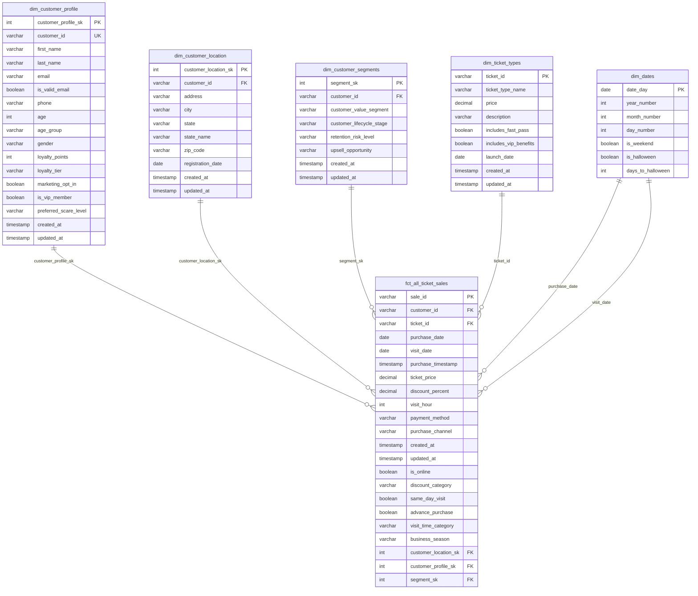

@"
# 🎢 DBT Commercial Analytics Data Model

[](https://www.getdbt.com/)
[](https://www.postgresql.org/)
[](LICENSE)
[](https://github.com/devmithun7/DBT-Commercial-Analytics-Data-Model/stargazers)

## 📋 Table of Contents

- [Project Overview](#-project-overview)
- [Repository Structure](#-repository-structure)
- [Data Model Architecture](#-data-model-architecture)
- [Entity Relationship Diagram](#-entity-relationship-diagram)
- [Getting Started](#-getting-started)
- [Model Documentation](#-model-documentation)
- [Data Quality & Testing](#-data-quality--testing)
- [Deployment](#-deployment)
- [Contributing](#-contributing)

---

## 🎯 Project Overview

This DBT project implements a comprehensive **commercial analytics data model** for a theme park or entertainment venue business. The model transforms raw transactional data into a dimensional data warehouse optimized for business intelligence and analytics.

### **Key Features**

- 🏗️ **Dimensional Modeling**: Star schema design with fact and dimension tables
- 👥 **Customer Analytics**: 360-degree customer view with segmentation and profiling
- 🎫 **Ticket Sales Analysis**: Comprehensive sales tracking and performance metrics
- 📊 **Business Intelligence Ready**: Optimized for reporting and dashboard creation
- 🧪 **Data Quality**: Built-in testing and validation framework
- 🔄 **Automated Workflows**: CI/CD pipeline with GitHub Actions

---

## 📁 Repository Structure

```
DBT-Commercial-Analytics-Data-Model/
│
├── 📂 .github/workflows/
│   ├── dbt_ci.yml                          # CI/CD pipeline for DBT
│   └── data_quality_checks.yml             # Automated data quality testing
│
├── 📂 macros/
│   ├── generate_schema_name.sql            # Custom schema naming logic
│   ├── get_custom_alias.sql                # Table aliasing macros
│   ├── data_quality_tests.sql              # Custom test macros
│   └── business_logic_helpers.sql          # Business calculation helpers
│
├── 📂 models/
│   ├── 📂 staging/
│   │   ├── stg_customers.sql               # Staging customer data
│   │   ├── stg_ticket_sales.sql            # Staging sales transactions
│   │   ├── stg_locations.sql               # Staging location data
│   │   └── _staging_sources.yml            # Source definitions
│   │
│   ├── 📂 intermediate/
│   │   ├── int_customer_metrics.sql        # Customer aggregated metrics
│   │   ├── int_sales_enriched.sql          # Enriched sales data
│   │   └── int_customer_segments.sql       # Customer segmentation logic
│   │
│   ├── 📂 marts/
│   │   ├── 📂 core/
│   │   │   ├── dim_customer_profile.sql    # Customer dimension table
│   │   │   ├── dim_customer_location.sql   # Location dimension table
│   │   │   ├── dim_customer_segments.sql   # Segmentation dimension
│   │   │   ├── dim_ticket_types.sql        # Ticket types dimension
│   │   │   ├── dim_dates.sql               # Date dimension
│   │   │   └── fct_all_ticket_sales.sql    # Main fact table
│   │   │
│   │   └── 📂 analytics/
│   │       ├── customer_lifetime_value.sql # CLV calculations
│   │       ├── sales_performance.sql       # Sales analytics
│   │       └── seasonal_trends.sql         # Seasonal analysis
│   │
│   └── schema.yml                          # Model documentation and tests
│
├── 📂 seeds/
│   ├── ticket_type_mappings.csv            # Static ticket type data
│   ├── location_hierarchies.csv            # Geographic hierarchies
│   └── business_calendar.csv               # Custom business calendar
│
├── 📂 snapshots/
│   ├── customer_profile_snapshot.sql       # SCD Type 2 for customers
│   └── ticket_pricing_snapshot.sql         # Price change tracking
│
├── 📂 tests/
│   ├── assert_positive_sales.sql           # Custom business logic tests
│   ├── assert_valid_customer_data.sql      # Customer data validation
│   └── assert_referential_integrity.sql   # Foreign key validation
│
├── 📄 .gitignore                           # Git ignore patterns
├── 📄 README.md                            # Project documentation
├── 📄 dbt_project.yml                      # DBT project configuration
└── 📄 packages.yml                         # DBT package dependencies
```

---

## 🏗️ Data Model Architecture

### **Dimensional Model Design**

The data model follows **Kimball methodology** with a star schema architecture:

#### **📊 Fact Tables**
- **`fct_all_ticket_sales`**: Central fact table containing all ticket sales transactions with measures and foreign keys to dimensions

#### **📋 Dimension Tables**
- **`dim_customer_profile`**: Consolidated customer information including demographics and preferences
- **`dim_customer_location`**: Geographic customer data and registration details
- **`dim_customer_segments`**: Customer segmentation and lifecycle classifications
- **`dim_ticket_types`**: Ticket product catalog with pricing and features
- **`dim_dates`**: Time dimension with business calendar attributes

### **Data Flow Architecture**

```
Raw Data Sources → Staging Models → Intermediate Models → Marts (Dimensions & Facts) → Analytics Models
```

1. **Staging Layer**: Clean and standardize raw source data
2. **Intermediate Layer**: Business logic transformations and enrichments
3. **Marts Layer**: Final dimensional model for consumption
4. **Analytics Layer**: Pre-built analytical models and KPIs

---

## 🔗 Entity Relationship Diagram



---

## 🚀 Getting Started

### **Prerequisites**

- **dbt Core 1.0+** or **dbt Cloud**
- **Python 3.8+**
- **Database**: PostgreSQL, Snowflake, BigQuery, or Redshift
- **Git** for version control

### **Installation**

1. **Clone the repository:**
```bash
git clone https://github.com/devmithun7/DBT-Commercial-Analytics-Data-Model.git
cd DBT-Commercial-Analytics-Data-Model
```

2. **Install dbt and dependencies:**
```bash
pip install dbt-core dbt-postgres  # or dbt-snowflake, dbt-bigquery, etc.
dbt deps
```

3. **Configure your profiles.yml:**
```yaml
dbt_commercial_analytics:
  target: dev
  outputs:
    dev:
      type: postgres  # or snowflake, bigquery, etc.
      host: your-database-host
      user: your-username
      password: your-password
      port: 5432
      dbname: your-database
      schema: dbt_dev
      threads: 4
```

### **Quick Start**

1. **Test database connection:**
```bash
dbt debug
```

2. **Install packages:**
```bash
dbt deps
```

3. **Run staging models:**
```bash
dbt run --select staging
```

4. **Build full data model:**
```bash
dbt build
```

5. **Generate documentation:**
```bash
dbt docs generate
dbt docs serve
```

---

## 📚 Model Documentation

### **Staging Models**

#### **`stg_customers`**
- **Purpose**: Standardizes raw customer data from source systems
- **Key Transformations**: Email validation, name standardization, data type casting
- **Business Rules**: Deduplication by customer_id, invalid email flagging

#### **`stg_ticket_sales`**
- **Purpose**: Cleans and standardizes ticket sales transaction data
- **Key Transformations**: Price calculations, timestamp parsing, channel mapping
- **Business Rules**: Excludes refunded transactions, validates positive prices

### **Dimension Models**

#### **`dim_customer_profile`**
- **Purpose**: Single source of truth for customer demographic and preference data
- **Key Features**: Age grouping, loyalty tier calculation, VIP status determination
- **Update Frequency**: Daily batch processing

#### **`dim_customer_segments`**
- **Purpose**: Customer segmentation based on behavior and value
- **Segmentation Logic**:
  - **Value Segments**: High/Medium/Low based on lifetime value
  - **Lifecycle Stages**: New/Active/At-Risk/Churned
  - **Retention Risk**: ML-based risk scoring

### **Fact Models**

#### **`fct_all_ticket_sales`**
- **Purpose**: Central fact table for all ticket sales analysis
- **Grain**: One row per ticket sale transaction
- **Key Measures**: ticket_price, discount_percent, visit_hour
- **Business Calculations**: same_day_visit, advance_purchase flags

---

## 🧪 Data Quality & Testing

### **Built-in Tests**

- **Uniqueness**: Primary key constraints on all dimension tables
- **Not Null**: Critical business fields validated for completeness
- **Referential Integrity**: Foreign key relationships validated
- **Accepted Values**: Categorical fields tested against valid value lists

### **Custom Tests**

#### **Business Logic Tests**
- **Positive Sales**: Ensures all ticket prices are positive
- **Valid Date Ranges**: Visit dates must be after purchase dates
- **Customer Data Integrity**: Email format and phone number validation

#### **Data Freshness Tests**
- **Source Freshness**: Alerts if source data is more than 24 hours old
- **Model Freshness**: Ensures models are rebuilt within SLA windows

### **Running Tests**

```bash
# Run all tests
dbt test

# Run tests for specific model
dbt test --select fct_all_ticket_sales

# Run only custom tests
dbt test --select test_type:custom
```

---

## 🚀 Deployment

### **Environment Strategy**

- **Development**: Local development and testing
- **Staging**: Pre-production validation and UAT
- **Production**: Live business intelligence environment

### **CI/CD Pipeline**

The project includes GitHub Actions workflows for:

1. **Continuous Integration**: Automated testing on pull requests
2. **Data Quality Checks**: Validation of data integrity and business rules
3. **Documentation Updates**: Auto-generation of model documentation
4. **Production Deployment**: Automated deployment to production environment

### **Deployment Commands**

```bash
# Deploy to staging
dbt run --target staging

# Deploy to production
dbt run --target prod

# Full refresh (recreate all tables)
dbt run --full-refresh

# Run specific tag
dbt run --select tag:daily
```

---

## 📊 Key Business Metrics

### **Customer Analytics**
- **Customer Lifetime Value (CLV)**: Predictive revenue per customer
- **Customer Acquisition Cost (CAC)**: Marketing efficiency metrics
- **Retention Rates**: Cohort-based retention analysis
- **Segmentation Performance**: Revenue by customer segment

### **Sales Analytics**
- **Revenue Trends**: Daily, weekly, monthly revenue tracking
- **Seasonal Patterns**: Halloween and holiday performance analysis
- **Channel Performance**: Online vs. offline sales comparison
- **Pricing Analytics**: Discount effectiveness and price optimization

### **Operational Metrics**
- **Capacity Utilization**: Visit patterns and peak time analysis
- **Product Performance**: Ticket type popularity and profitability
- **Geographic Analysis**: Sales performance by customer location

---

## 🤝 Contributing

Contributions are welcome! Please follow these guidelines:

### **Development Workflow**

1. **Fork the repository**
2. **Create feature branch**: `git checkout -b feature/new-model`
3. **Make changes and test**: `dbt run && dbt test`
4. **Update documentation**: Add model descriptions and tests
5. **Submit pull request**: Include description of changes and business impact

### **Code Standards**

- **SQL Style**: Follow dbt SQL style guide
- **Naming Conventions**: Use consistent prefixes (stg_, int_, dim_, fct_)
- **Documentation**: All models must have descriptions and column documentation
- **Testing**: Include appropriate tests for all new models

### **Model Development Guidelines**

```sql
-- Example model structure
{{ config(
    materialized='table',
    tags=['daily', 'customer'],
    description='Customer dimension with demographic and preference data'
) }}

with source_data as (
    select * from {{ ref('stg_customers') }}
),

transformed as (
    select
        customer_id,
        first_name,
        last_name,
        -- Add business logic here
        case 
            when age between 18 and 25 then 'Young Adult'
            when age between 26 and 40 then 'Adult'
            else 'Senior'
        end as age_group
    from source_data
)

select * from transformed
```

---

## 📄 License

This project is licensed under the MIT License - see the [LICENSE](LICENSE) file for details.

---

## 📧 Contact

**Mithun** - [@devmithun7](https://github.com/devmithun7)

Project Link: [https://github.com/devmithun7/DBT-Commercial-Analytics-Data-Model](https://github.com/devmithun7/DBT-Commercial-Analytics-Data-Model)

---

## 🙏 Acknowledgments

- [dbt Labs](https://www.getdbt.com/) for the amazing transformation framework
- [Kimball Group](https://www.kimballgroup.com/) for dimensional modeling methodology
- [dbt Community](https://discourse.getdbt.com/) for best practices and support

---

## ⭐ Show your support

Give a ⭐️ if this project helped you build better data models!
"@ | Out-File -FilePath "DBT_README.md" -Encoding UTF8
